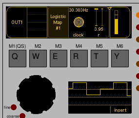
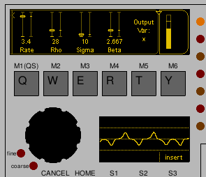

# Chaotic Modulations

Basic chaotic modulation source units.

## Logistic Map

A clocked modulation source modelling the basic [logistic map](https://en.wikipedia.org/wiki/Logistic_map) equation.

Other than the clock input, there is a single parameter `r`. With `r` in the range `[3.56995, 4]` the sequence is chaotic for most values of `r`. Smaller values of `r` in that range exhibit more periods of (approximately) periodic behaviour, before sudden changes. With `r` Below 3.56995 the sequence will converge towards oscillating between 1, 2, 4 , 8, or 16 fixed values.

## Lorenz system

This is a continuous modulation source.

The [Lorenz system](https://en.wikipedia.org/wiki/Lorenz_system) is defined by a set of three ordinary differential equations.

There other than the rate, there are three parameters in the differential equations that can be adjusted from their starting values of `ρ = 28`, `σ = 10`, and `β = 8/3`. Care must be taken: it's pretty easy to land on values where oscillation stops entirely.

There are three options for the output corresponding to the the variables in the system of differential equations: `x`, `y`, and `z`. For many parameters `x` and `y` will exhibit quite similar behaviour, but not always.
